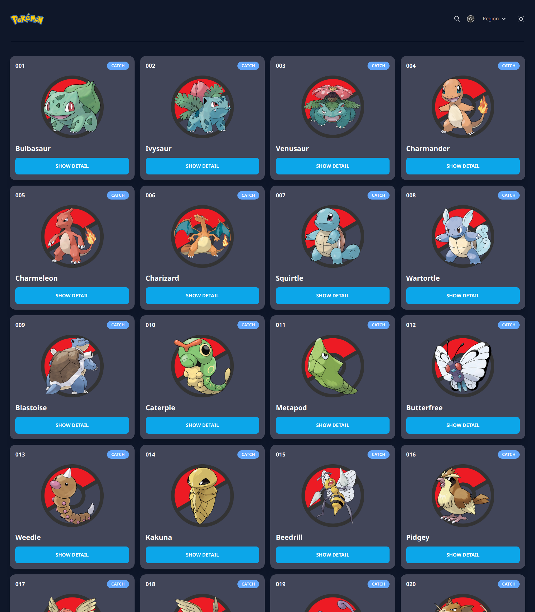

<div align="center">

<!-- PROJECT LOGO -->


</div>

# POKEDEX

> POKEDEX is a website that contains data about pokemon. All Pokemon data used in this project comes from [pokeAPI v2](https://pokeapi.co/docs/v2) and [PokeAPI GraphQL Beta](https://pokeapi.co/docs/graphql).
> Playground: https://beta.pokeapi.co/graphql/console/

## ✨ Demo

Here is a working live demo : https://pokemon-rizalyoga.vercel.app/

<!-- ## 🎥 Video Demo -->

<!-- https://user-images.githubusercontent.com/28485636/194340288-9e7a2a74-0e23-4f84-b144-cd01c47da8bb.mp4 -->

## 🖼️ Pages

### Homepage Light Mode


### Homepage Dark Mode



### Pokemon Detail Page


## 🔮 Features

- displays the entire list of pokemon
- Show detail pokemon
- displays list of pokemon by region
- Search pokemon
- light & dark mode
- infinite scroll
- scroll to top button

## 🧰 Run in locale

To clone and run this website, you'll need [Git](https://git-scm.com) and [Node.js](https://nodejs.org/en/download/) (which comes with [yarn](https://yarnpkg.com/)) installed on your computer. From your command line:

```bash
# Clone this repository
$ git clone https://github.com/rizalyoga/pokemon.git

# Go into the repository
$ cd pokemon

# Install dependencies
$ yarn

# Run the app
$ yarn dev
```

## ⛏️ Built with

- [React JS](https://react.dev/) - React is a JavaScript library used to build component-based interactive user interfaces. React is created by Facebook and is open-source, so anyone can use it for free.

- [Vercel](https://vercel.com/) - Vercel is the best place to deploy any frontend app. Start by deploying with zero configuration to our global edge network. Scale dynamically to millions of pages without breaking a sweat.

## 👤 Authors

- [Rizalyoga](https://github.com/rizalyoga/)
